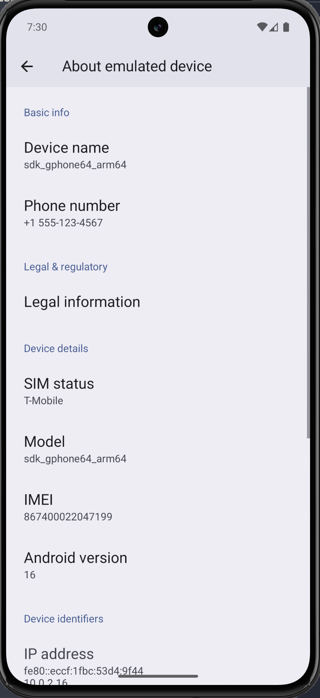
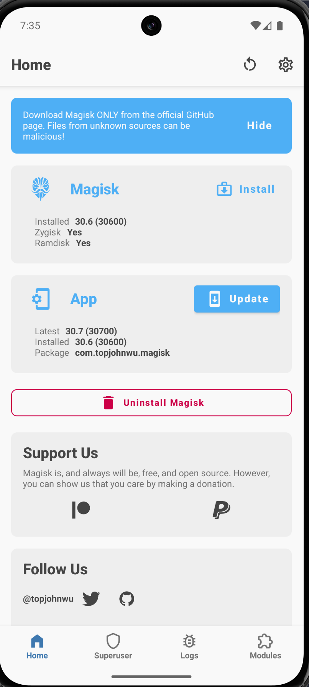
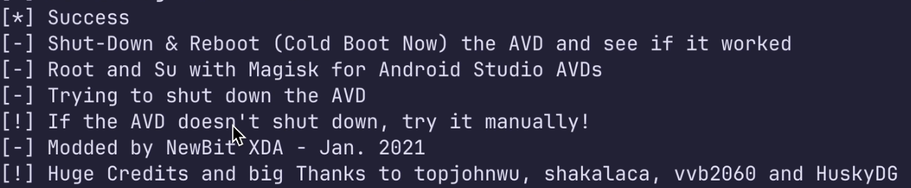
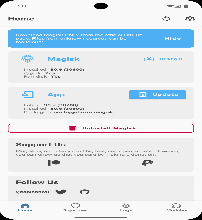
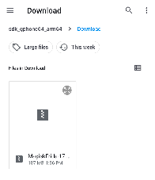
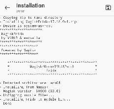
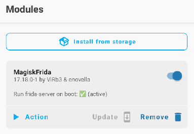
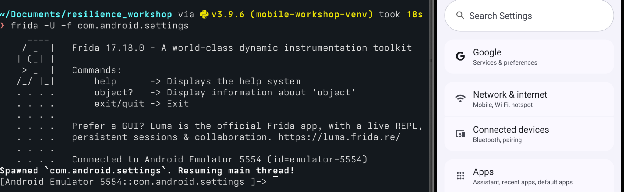

# Mobile Application Security Workshop Setup Guide

## Prerequisites

This workshop was tested on these platforms:

- Linux on x86_64
- macOS on Apple silicon

Requirements:

- At least **8 GB** of **RAM**
- **32 GB** of free **disk** space
- Intel VT-x or AMD-V virtualization and access to KVM on Linux

## Install Android Studio

!!! note
    These steps were documented and reproduced in September 2026. The steps can
    change after that date.

1. Open the [official Android Studio](https://developer.android.com/studio)
   download page.
2. Download the installer for your computer.

### macOS

1. Select the **Mac with Apple chip** download.
2. Open the DMG file.
3. Drag Android Studio into **Applications**.
4. Open Android Studio from **Applications**.
5. If macOS displays a warning, confirm that you want to open Android Studio.

### Linux x86_64

1. Download the Linux TAR.GZ file.
2. Open **Downloads** in your file manager.
3. Extract the archive into a directory where you have write permission.
4. Open a terminal in the `android-studio/bin` directory.
5. Run `studio` or `studio.sh`, as applicable to the downloaded version.

### Complete the Initial Setup Wizard

1. For a new installation, select **Don't import settings**.
2. Continue to **Install Type**.
3. Select **Standard**.
4. Accept the licenses.
5. Select **Finish**.
6. Wait for the downloads to finish.
7. Don't create an Android project.

## Configure an Android Virtual Device

For the simplest setup, use the provided pre-rooted Android 16 firmware image.
Otherwise, [configure and root the device manually](#configure-and-root-the-device-manually).

### Import a Pre-Rooted Firmware Image

Follow these steps to import the firmware image and create an Android Virtual
Device (AVD):

1. Select `workshop_<arch>_image.zip` for your host architecture.
2. Extract the archive into `$ANDROID_HOME/system-images/android-36/`.

    

3. Restart Android Studio and open **Virtual Device Manager**.
4. Select **Create Device**.
5. Select **Phone**.
6. Select **Pixel 8**, and then select **Next**.

    

7. Enter `Pixel8workshop` as the device name.
8. Select **API 36.0**.
9. Select **MASTG <arch> System Image**, and then select **Finish**.

    

10. Start the AVD.

    

11. Install Magisk Manager 30.6.
12. If Magisk requests a reboot, reboot the AVD to finish the installation.

    

### Configure and Root the Device Manually

#### Create a Virtual Device

1. Return to the Android Studio welcome screen.
2. Select **More Actions** -> **Virtual Device Manager**.
3. Select **Create Device**.
4. Select **Phone**.
5. Select **Pixel 8**.
6. Select **Next**.
7. Find **Android 16 (API level 36)**.
8. Select a Google Play system image for your host architecture:

    1. On Linux x86_64, select **x86_64**.
    2. On macOS with Apple silicon, select **arm64-v8a**.

9. Download the image and accept its license.
10. Select **Next**.
11. Name the device.
12. In the advanced settings, select **Cold boot** if this option is available.
13. Select **Finish**.

#### Prepare the Android SDK Paths

Run only the commands for your platform.

On macOS, run:

```shell
export ANDROID_HOME="$HOME/Library/Android/sdk"
export PATH="$ANDROID_HOME/platform-tools:$PATH"
```

On Linux, run:

```shell
export ANDROID_HOME="$HOME/Android/Sdk"
export PATH="$ANDROID_HOME/platform-tools:$PATH"
```

Verify that Android Debug Bridge (ADB) detects the device:

```shell
adb devices
```

!!! important
    Connect only the workshop emulator. The rootAVD script doesn't support
    multiple ADB devices at the same time.

#### Download rootAVD

1. Clone the [rootAVD GitLab repository](https://gitlab.com/newbit/rootAVD).
2. Don't use the old GitHub repository as the source for the current version.

#### Select the Image to Modify

1. Keep the emulator running and unlocked.
2. In the terminal, go to the rootAVD directory.
3. List all AVD images:

    ```shell
    bash ./rootAVD.sh ListAllAVDs
    ```

4. Find the entry for Android 16, Google Play, and your host architecture.
5. On Linux x86_64, use the entry that ends with this path:
   `system-images/android-36/google_apis_playstore/x86_64/ramdisk.img`.

#### Start the Installation

Run only the command for your platform.

On Linux x86_64, run:

```shell
bash ./rootAVD.sh system-images/android-36/google_apis_playstore/x86_64/ramdisk.img FAKEBOOTIMG
```

On macOS, run:

```shell
bash ./rootAVD.sh system-images/android-36/google_apis_playstore/arm64-v8a/ramdisk.img FAKEBOOTIMG
```

1. When the version menu appears, select Magisk 30.6.

    

2. Wait for rootAVD to open Magisk in the emulator.

#### Patch the Image in Magisk

1. In the Magisk section, select **Install**.

    

2. Select **Select and Patch a File**.
3. Open **Downloads**.
4. Select `fakeboot.img`.
5. Select **Let's Go**.
6. Wait for the patch operation to finish.
7. Return to the terminal.
8. When rootAVD prompts you, press Enter.
9. Wait for rootAVD to copy the modified image.

    

!!! warning
    Keep the terminal and emulator open while rootAVD modifies the image.
    Closing either application can interrupt the modification.

#### Restart and Check Magisk

1. After rootAVD finishes, stop the emulator if it is still running.
2. In **Device Manager**, open the device menu.
3. Select **Cold Boot** or **Cold Boot Now**.
4. Wait for Android to start.
5. Open Magisk.
6. If Magisk requests additional setup, accept it and permit the restart.
7. Confirm that Magisk displays **Yes** for **Zygisk** and **Ramdisk**.

    

## Install Frida

### Install MagiskFrida on the Android Virtual Device

MagiskFrida is a Magisk module that starts `frida-server` when Android boots.
The workshop pins MagiskFrida to release `17.18.0-1`.

1. Download the
   [MagiskFrida ZIP release](https://github.com/ViRb3/magisk-frida/releases/tag/17.18.0-1).
2. Don't extract the ZIP file.
3. Drag the ZIP file from your computer into the emulator window.
4. Wait for the transfer to finish.
5. Open Magisk, and then select **Modules** -> **Install from storage**.
6. Open **Download** and select the MagiskFrida ZIP file.

    

7. Wait for the installation to finish.

    

8. Select **Reboot**.
9. After the restart, open Magisk, and then select **Modules**.
10. Confirm that MagiskFrida is installed, enabled, and active.
11. If **active** doesn't appear, select **Action** or reboot the device.

    

### Install Frida Client Tools on the Host Computer

The MagiskFrida module installs the server on Android. You must also install the
Frida client tools on your computer.

1. Download and install Python 3.9.6 for your computer.
2. Create and activate a Python virtual environment:

    ```shell
    python3 -m venv "$HOME/mobile-workshop-venv"
    source "$HOME/mobile-workshop-venv/bin/activate"
    ```

3. Install the client tools and the Frida version that matches MagiskFrida:

    ```shell
    python -m pip install frida-tools "frida==17.18.0"
    ```

MagiskFrida release `17.18.0-1` uses Frida `17.18.0`. The `-1` suffix
identifies the module release. The `frida-tools` and `frida` packages use
different version numbers.

### Check the Frida Connection

With the emulator running and the Python environment active, run:

```shell
frida -U -f com.android.settings
```

Android Settings should start on the device. The Frida command-line interface
(CLI) should appear in the terminal.



## Additional Notes

- After the checks pass, don't update the Android system image, Magisk, or Frida
  before the workshop.
- If a step fails, send the organizers your platform, installed versions, and
  the complete error message.
